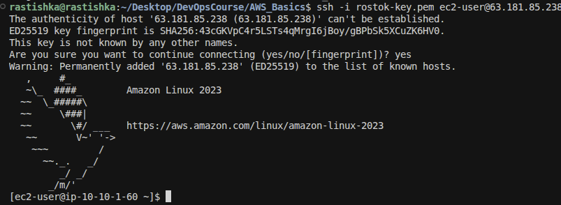

# Cтворення та налаштування VPC

## Створення VPC
Перейдіть до сервісу VPCs
Натисніть Create VPC
Виберіть VPC only
Name tag auto-generation: rostok-imported-stack-VPC
IPv4 CIDR block: 10.10.0.0/16
Натисніть Create VPC

## Створення двох підмереж
У меню VPC виберіть Subnets натисніть Create subnet
VPC ID: Виберіть rostok-imported-stack-VPC

Публічна підмережа:
Subnet name: rostok-imported-stack-Public-Subnet
Availability Zone: eu-central-1a
IPv4 CIDR block: 10.10.1.0/24

Приватна підмережа:
Натисніть Add another subnet
Subnet name: rostok-imported-stack-Private-Subnet
Availability Zone: eu-central-1b
IPv4 CIDR block: 10.10.2.0/24

Натисніть Create subnet

## Створення та налаштування Інтернет-шлюзу (IGW)
У меню VPC виберіть Internet Gateways та натисніть Create internet gateway
Name tag: rostok-imported-stack-IGW
Натисніть Create internet gateway
Виберіть створений IGW, натисніть Actions -> Attach to VPC
Виберіть rostok-imported-stack-VPC та натисніть Attach internet gateway

## Налаштування таблиць маршрутизації
У меню VPC виберіть Route Tables
Натисніть Create route table
Name: rostok-imported-stack-Public-RT
VPC: rostok-imported-stack-VPC
Переходимо на rostok-imported-stack-Public-RT
Add route:
Destination: 0.0.0.0/0
Target: Виберіть ваш Internet Gateway rostok-imported-stack-IGW

# Налаштування груп безпеки (Security Groups)

## Перейдіть до сервісу EC2
У навігаційній панелі виберіть Security Groups
Натисніть Create security group
Security group name: rostok-SSH-Manual-SG
Description: HTTP and SSH
VPC: Виберіть rostok-imported-stack-VPC
Inbound rules:
Rule 1 (HTTP): Type: HTTP, Port: 80, Source: Anywhere-IPv4 (0.0.0.0/0).
Rule 2 (SSH): Type: SSH, Port: 22, Source: Anywhere-IPv4 (0.0.0.0/0).
Натисніть Create security group

# Запуск інстансу EC2

## Перейдіть до сервісу Instance та натисніть Launch instance
Name: rostok-imported-stack-Public-Server
Application and OS Images: Виберіть Amazon Linux
Instance type: t3.micro 
Key pair: Виберіть існуючий .pem файлу
Network settings: Натисніть Edit
VPC: rostok-imported-stack-VPC
Subnet: rostok-imported-stack-Public-Subnet
Auto-assign public IP: Встановіть Enable
Security groups: Виберіть Select existing security group та вкажіть rostok-SSH-Manual-SG
Натисніть Launch instance

# Призначення еластичної IP-адреси

## Створення EIP
Перейдіть до сервісу EC2 та у навігаційній панелі виберіть Elastic IPs
Натисніть Allocate Elastic IP address
Залиште налаштування за замовчуванням (Amazon's pool) та натисніть Allocate
name: rostok-public-ip

## Прив'язка EIP до інстансу
Виберіть щойно створену EIP у списку
Натисніть Actions -> Associate Elastic IP address
Resource type: Виберіть Instance
Instance: Знайдіть та виберіть ваш інстанс rostok-imported-stack-Public-Server
Натисніть Associate

# Підєднання по ssh

підключаємося виковши команду

```bash
ssh -i rostok-key.pem ec2-user@63.181.85.238
```

результат

