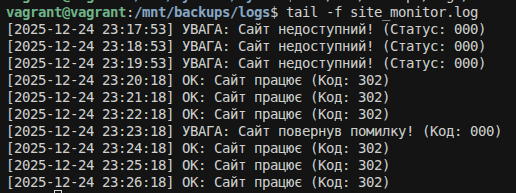
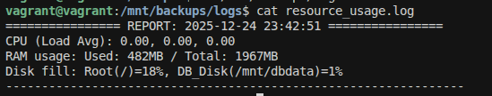
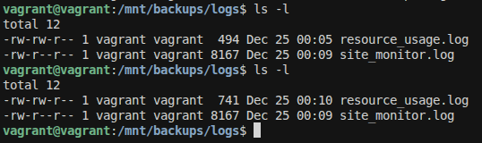
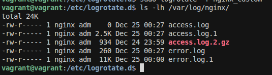

# 1. Створити простий Bash скрипт для автоматичного резервного копіювання директорії /mnt/dbdata до /mnt/backup кожного дня. Налаштуйте cron job для виконання цього скрипта щодня о 2:00 ранку.

створення папки для скриптів

    vagrant@vagrant:/$ cd home/vagrant
    vagrant@vagrant:~$ pwd
    /home/vagrant
    vagrant@vagrant:~$ mkdir -p scripts
    vagrant@vagrant:~$ cd scripts

робимо скрипт

    #!/bin/bash - каже системі це не просто текст запусти його 

    START_TIME=$(date +%Y-%m-%d_%H-%M-%S)
    START_DATE=$(date +%Y-%m-%d)

    BACKUP_DIR="/mnt/backups"
    LOG_FILE="$BACKUP_DIR/backup_log.txt"

    DB_NAME="skill_quest_db"
    DB_USER="skilluser"
    DB_BACKUP="$BACKUP_DIR/db_dump_$START_DATE.sql.gz"

    RETENTION_DAYS=7

    echo "Старт бекапу БАЗИ ДАНИХ: $START_TIME" >> $LOG_FILE

    export PGPASSWORD='postgres'

    pg_dump -U $DB_USER -h localhost $DB_NAME | gzip > $DB_BACKUP

    if [ $? -eq 0 ]; then
        echo "[$START_TIME] УСПІХ: База збережена у $DB_BACKUP" >> $LOG_FILE
    else
        echo "[$START_TIME] ПОМИЛКА: Не вдалося створити дамп бази!" >> $LOG_FILE
    fi

    echo "Очищення копій, старіших за $RETENTION_DAYS днів..." >> $LOG_FILE
    find $BACKUP_DIR -type f -name "*.gz" -mtime +$RETENTION_DAYS -exec rm {} \;

    FINISH_TIME=$(date +%Y-%m-%d_%H-%M-%S)
    echo "Кінець бекапу: $FINISH_TIME" >> $LOG_FILE

створенняфайлу дял скрипта та вскавляємо його

    nano backup.sh

робимо надання прав на виконання щоб сиситема знала що цей текстовий фал можна запустити як програму

    chmod +x backup.sh

запускаємо команду
    
    ./backup.sh

фото результату

налаштування cron
відкриваємо планувальник(відкриваю вперше тому натискаю 1 щоб відкрити nano)

    crontab -e

в кінець вставляємо запис розкладу

    5 17 * * * /home/vagrant/scripts/backup.sh

розшифровка

    у cron є 5 полів для часу:
        5 — хвилина (0-ва хвилина)
        17 — година (7-га година ранку)
        * — день місяця (кожен день)
        * — місяць (кожен місяць)
        * — день тижня (кожен день тижня)
    та шлях то файлу який треба запустити

видаляємо старий бекап та чекаємо 17:05 щоб backup зробився

# 2. Створити та налаштувати власний systemd сервіс для автоматичного запуску скрипта, який перевіряє доступність веб-сайту та записує результат у лог-файл.

створюємо папку з логами в директорії з backup

    mkdir logs

створюємо баш для моніторингу логів сайту

    #!/bin/bash

    URL="http://localhost:80"
    LOG_FILE="/mnt/backups/logs/site_monitor.log"

    while true
    do

        HTTP_STATUS=$(curl -s -o /dev/null -w "%{http_code}" $URL)
        TIMESTAMP=$(date "+%Y-%m-%d %H:%M:%S")

        if [ "$HTTP_STATUS" -eq 200 ] || [ "$HTTP_STATUS" -eq 302 ]; then
            echo "[$TIMESTAMP] OK: Сайт працює (Код: $HTTP_STATUS)" >> $LOG_FILE
        else
            echo "[$TIMESTAMP] УВАГА: Сайт повернув помилку! (Код: $HTTP_STATUS)" >> $LOG_FILE
        fi

        sleep 60
    done

у папочці script яку створили до цього створюємо файл та вставляємо в нього створений bash

    nano site_logs.sh

права на виконання

    chmod +x site_logs.sh

створємо конфіг для systemd сервісу
конфіг

    [Unit]
    Description=Monitoring web site
    After=network.target nginx.service

    [Service]
    User=vagrant
    ExecStart=/bin/bash /home/vagrant/scripts/site_logs.sh
    Restart=always
    RestartSec=10

    [Install]
    WantedBy=multi-user.target

створюємо сервіс

    sudo nano site-monitor.service

оновлюємо память systemd щоб він побачив новий файл

    sudo systemctl daemon-reload

дозвіл автозапуску при старті системи

    sudo systemctl enable site-monitor.service

запускаємо сервіс

    sudo systemctl start site-monitor.service

дивимося логи 

# 3. Написати скрипт для моніторингу використання ресурсів системи та збереження результатів у файл.

створення скрипта

    #!/bin/bash

    LOG_FILE="/mnt/backups/logs/resource_usage.log"

    echo "================ REPORT: $(date '+%Y-%m-%d %H:%M:%S') ================" >> $LOG_FILE

    CPU_LOAD=$(uptime | awk -F'load average:' '{ print $2 }')
    echo "CPU (Load Avg):$CPU_LOAD" >> $LOG_FILE

    RAM_USAGE=$(free -m | grep Mem | awk '{print "Used: " $3 "MB / Total: " $2 "MB"}')
    echo "RAM usage: $RAM_USAGE" >> $LOG_FILE

    DISK_ROOT=$(df -h / | tail -1 | awk '{print $5}')
    DISK_DB=$(df -h /mnt/dbdata | tail -1 | awk '{print $5}')
    echo "Disk fill: Root(/)=$DISK_ROOT, DB_Disk(/mnt/dbdata)=$DISK_DB" >> $LOG_FILE

    echo "----------------------------------------------------------------" >> $LOG_FILE

у папочці script яку створили до цього створюємо файл та вставляємо в нього створений bash

    nano resource_monitor.sh

запускаємо скрипт 

    /home/vagrant/scripts/resource_monitor.sh

дивимося чи є моніторинг ресурсів

зробимо крон щоб працював кожні 5 хв

    crontab -e

втаставляємо

    */10 * * * * /home/vagrant/scripts/resource_monitor.sh

дивимось чи змінилося

# 4. Зробити ротування файлу з access логом Nginx

пишемо правило

    /var/log/nginx/*.log {
        daily
        missingok
        rotate 7
        compress
        delaycompress
        notifempty
        create 0640 www-data adm
        sharedscripts
        postrotate
            [ -f /var/run/nginx.pid ] && kill -USR1 `cat /var/run/nginx.pid`
        endscript
    }

створюємо файл конфігурацій

    sudo nano nginx_custom

запускаємо його

    sudo logrotate -f nginx_custom

виводимо результат

