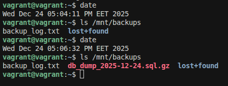
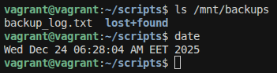

# 1. Створити простий Bash скрипт для автоматичного резервного копіювання директорії /mnt/dbdata до /mnt/backup кожного дня. Налаштуйте cron job для виконання цього скрипта щодня о 2:00 ранку.

створення папки для скриптів

    vagrant@vagrant:/$ cd home/vagrant
    vagrant@vagrant:~$ pwd
    /home/vagrant
    vagrant@vagrant:~$ mkdir -p scripts
    vagrant@vagrant:~$ cd scripts

робимо скрипт

    #!/bin/bash - каже системі це не просто текст запусти його 

    START_TIME=$(date +%Y-%m-%d_%H-%M-%S)
    START_DATE=$(date +%Y-%m-%d)

    BACKUP_DIR="/mnt/backups"
    LOG_FILE="$BACKUP_DIR/backup_log.txt"

    DB_NAME="skill_quest_db"
    DB_USER="skilluser"
    DB_BACKUP="$BACKUP_DIR/db_dump_$START_DATE.sql.gz"

    RETENTION_DAYS=7

    echo "Старт бекапу БАЗИ ДАНИХ: $START_TIME" >> $LOG_FILE

    export PGPASSWORD='postgres'

    pg_dump -U $DB_USER -h localhost $DB_NAME | gzip > $DB_BACKUP

    if [ $? -eq 0 ]; then
        echo "[$START_TIME] УСПІХ: База збережена у $DB_BACKUP" >> $LOG_FILE
    else
        echo "[$START_TIME] ПОМИЛКА: Не вдалося створити дамп бази!" >> $LOG_FILE
    fi

    echo "Очищення копій, старіших за $RETENTION_DAYS днів..." >> $LOG_FILE
    find $BACKUP_DIR -type f -name "*.gz" -mtime +$RETENTION_DAYS -exec rm {} \;

    FINISH_TIME=$(date +%Y-%m-%d_%H-%M-%S)
    echo "Кінець бекапу: $FINISH_TIME" >> $LOG_FILE

створенняфайлу дял скрипта та вскавляємо його

    nano backup.sh

робимо надання прав на виконання щоб сиситема знала що цей текстовий фал можна запустити як програму

    chmod +x backup.sh

запускаємо команду
    
    ./backup.sh

фото результату

налаштування cron
відкриваємо планувальник(відкриваю вперше тому натискаю 1 щоб відкрити nano)

    crontab -e

в кінець вставляємо запис розкладу

    0 7 * * * /home/vagrant/scripts/backup.sh

розшифровка

    у cron є 5 полів для часу:
        0 — хвилина (0-ва хвилина)
        7 — година (7-га година ранку)
        * — день місяця (кожен день)
        * — місяць (кожен місяць)
        * — день тижня (кожен день тижня)
    та шлях то файлу який треба запустити

видаляємо старий бекап та чекаємо 7:30 щоб backup зробився

# 2. Створити та налаштувати власний systemd сервіс для автоматичного запуску скрипта, який перевіряє доступність веб-сайту та записує результат у лог-файл.

# 3. Написати скрипт для моніторингу використання ресурсів системи та збереження результатів у файл.

# 4. Зробити ротування файлу з access логом Nginx.