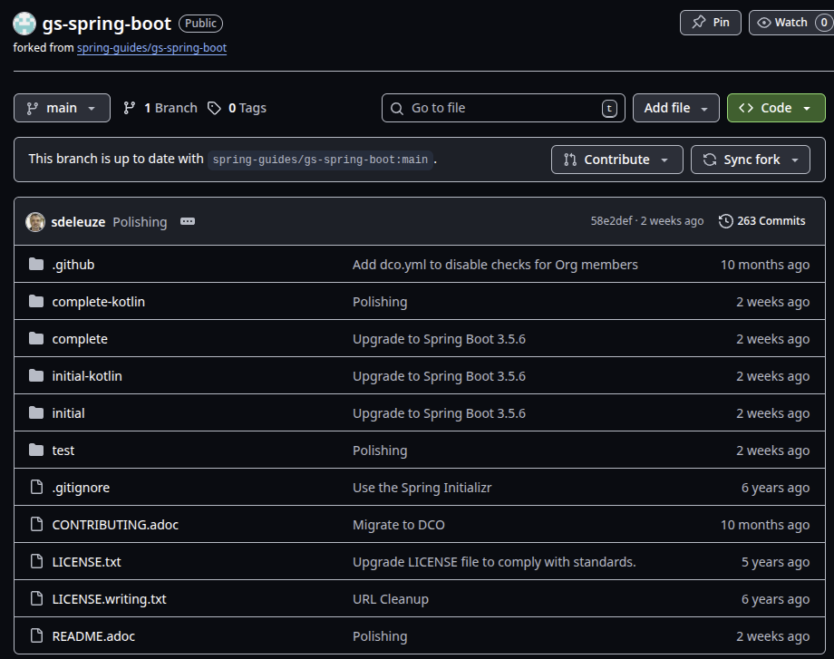
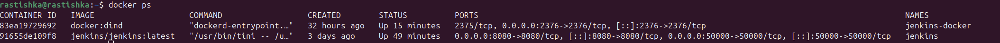
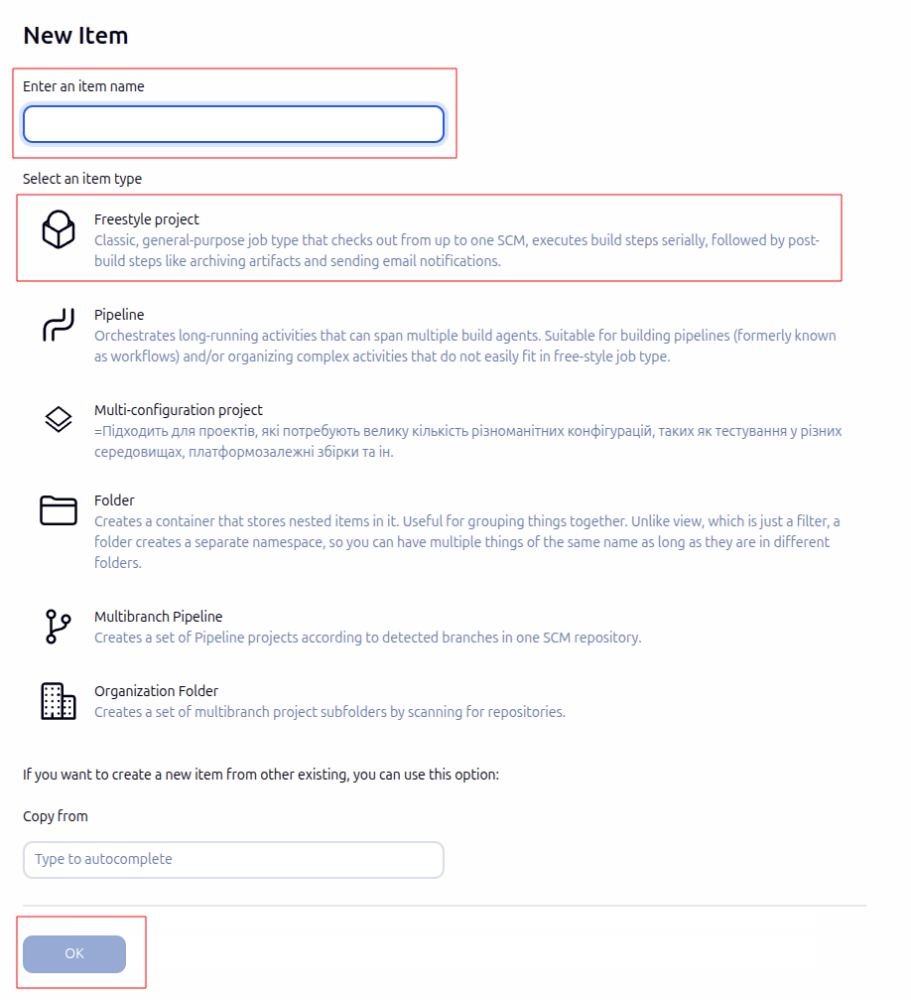
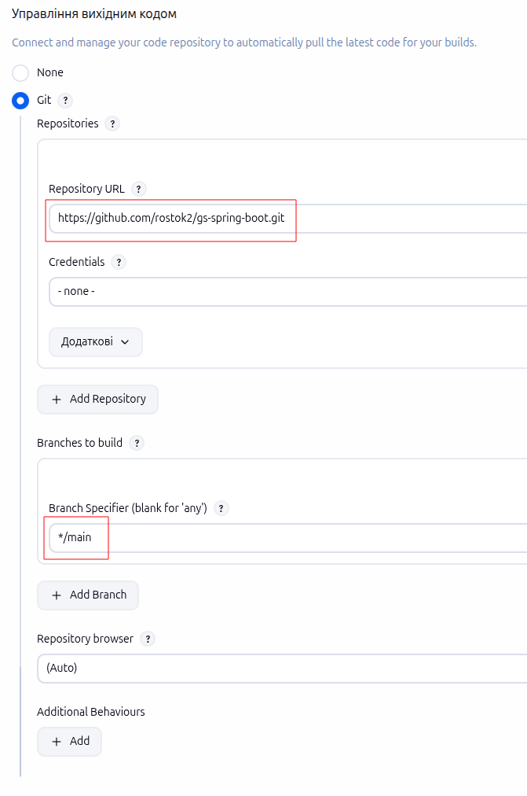
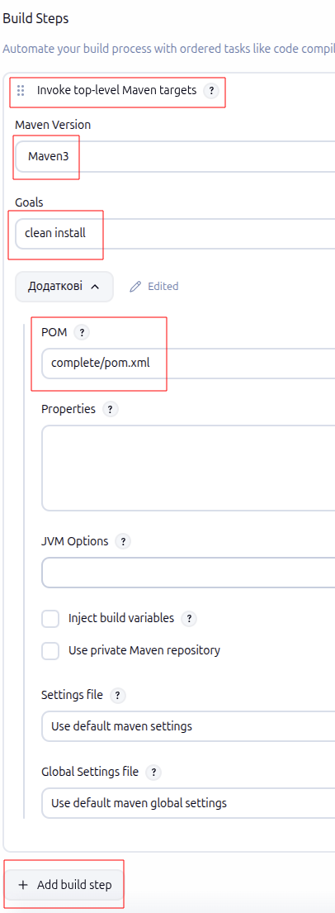
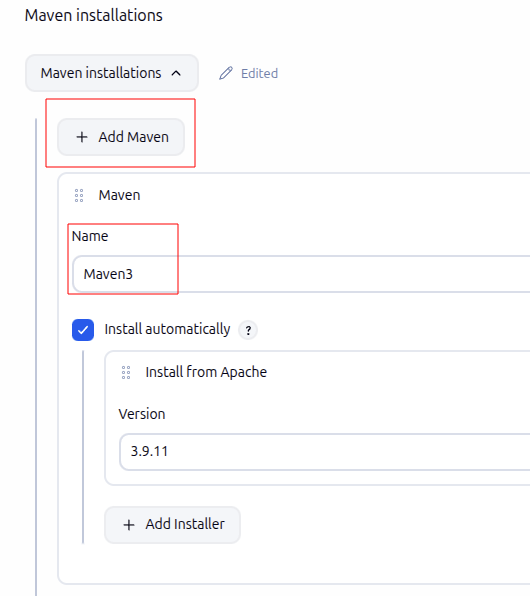
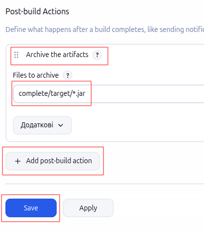
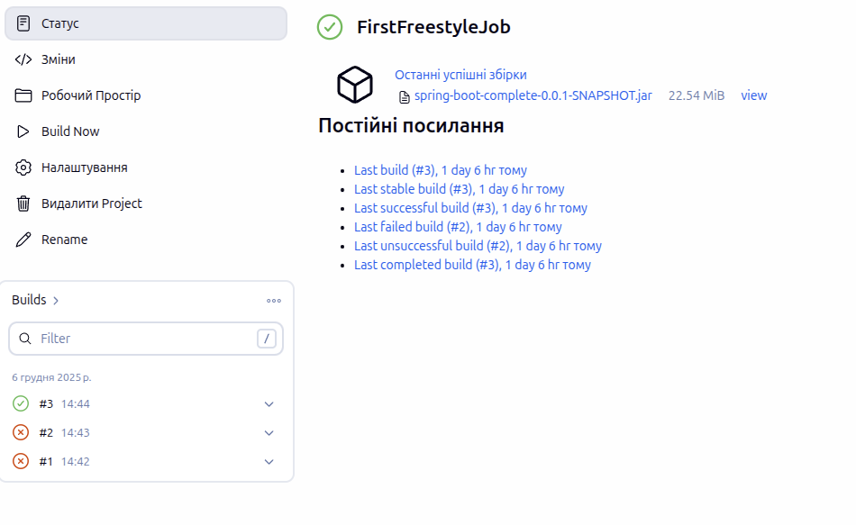
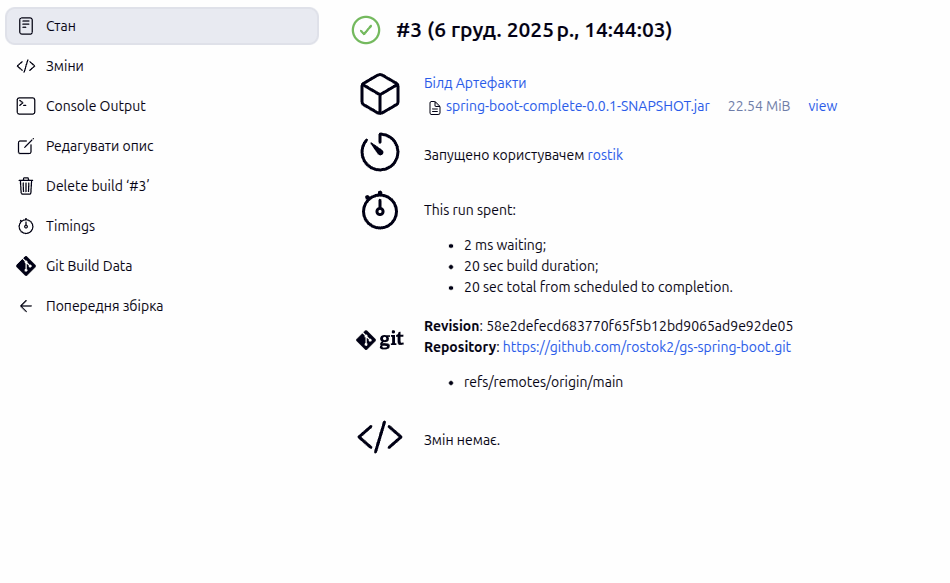
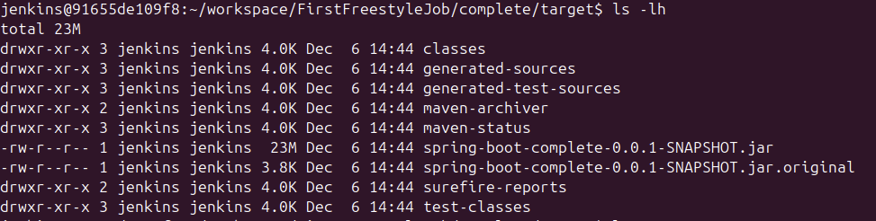

1. Форкніть проєкт:
    

Завдання 1: Деплой Jenkins
в даному репозиторії розміщена папка Jenkins в якій знаходиться docker-compose через який били запущені два контейнера
    

Завдання 2: Налаштувати Freestyle Job
1. Створіть Freestyle Job у Jenkins:
    Пишемо назву Job яку нам потрібно створити обираємо тип freestyle project та натискаємо ОК
    

2. У налаштуваннях:
    В пункті Управління вихідним кодом нам потрібно обрати Git та вписати данні які зображені на скріншоті посилання на репозиторій та гілку так як по замовчуванню йде master в нашому репозиторії main
    

    натискаємо на add build step обираємо Invoke top-level Maven targets обираємо версію Maven(потрібно було автоматично його добавити через Tools) та команду clean install(mvn писати не потрібно так як він додасця автоматично)
    також потрібно прописати шлях до папки де лежить pom.xml файл так як якщо його не буле то воне почне його шукати в коріні репозиторію але не знайде і білд не спрацює томупотрібно прописати до нього шлях
    

    Maven додати в ручну Manage Jenkins(справа зверну шестерня) → Tools → Maven Installations → Add Maven та прописати назву
    

    натискаємо add post-build action обираємо Archive the artifacts та прописуємо де в нас буде створено артефакт натискаємо Save
    

    Результат натискаємо Build Now та чекаємо на завершення
    

    та спостерігаємо що білд пройшов успішно та артефакт створено
    
    

Висновок:
    
