Інсталяція Nginx на віртуальну машину

Створено Vagrantfile(більш детальні можна подивиттися відкривши його) в якому в нас одразу запускається скрипт provision.sh(більш детальні можна подивиттися відкривши його) для завантаження вееб серверу Nginx, запускаємо vagrant up, після успішного завантаженя переходиом за посиланням http://localhost:8081/ має зявитися стандарттна сторінка коли nginx встановлений 
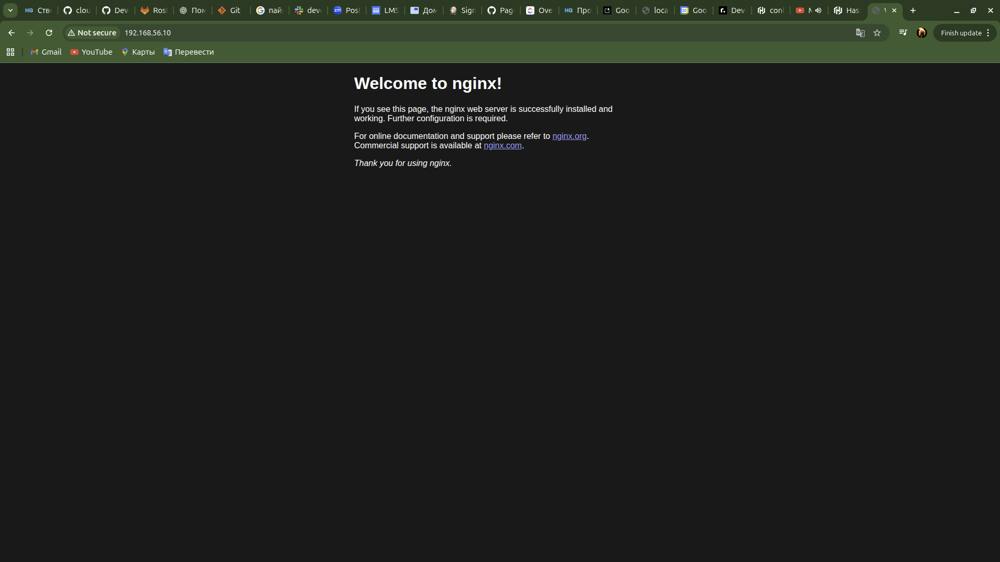

за допомогою vargant ssh через термінал приєднуємося до віртуальної машини
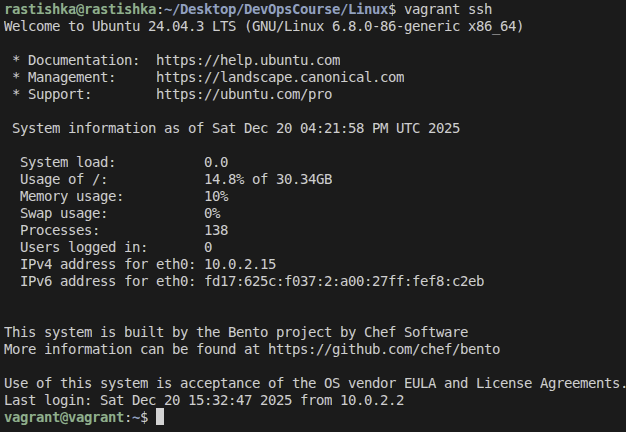

1. Як саме запускається сервіс і чим керується?

    Команда для перевірки статусу systemctl status nginx
    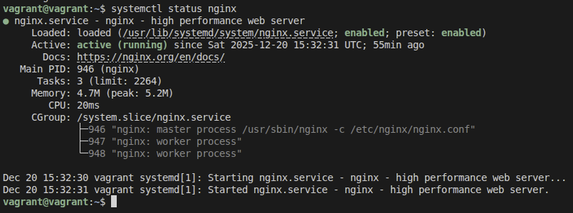

        Main PID: 946 (nginx) - номер головного процесу (master process)
        Tasks: 3 кількість процесів nginx у системі.
        CGroup - ієрархія процесів
            946 (master process) - директор який виконує задачі
            947 та 948 (worker process) - робітники які виконують ці задачі

    тут є Loaded у ньомо вказаний шлях /usr/lib/systemd/system/nginx.service це інструкція для запуску, подивимося що там 
    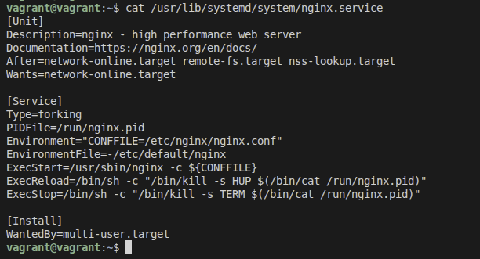

        Секція Unit
            After=network-online.target - nginx не почне працювати поки не буде інтернету

        Секція Service
            Type=forking - Nginx створює свою копію(fork) початковий процес завертається, ця копія стає головним процесом та працює у фоновому режимі
            PIDFile=/run/nginx.pid - оскільки nginx працює у фоновому режимі, системі потрібно знати його Process ID щоб звернутися до нього
            ExecStart=/usr/sbin/nginx -c ${CONFFILE} - грубо кажучи воно каже запусти програму nginx з ось цим файлом конфігурацій
            ExecReload=/bin/sh -c "/bin/kill -s HUP $(/bin/cat /run/nginx.pid)" - як оновити сервер без його вимкнення
            ExecStop=/bin/sh -c "/bin/kill -s TERM $(/bin/cat /run/nginx.pid)" - як правильно вимкнути сервер

        Секція Install
            WantedBy=multi-user.target - запускай сервіс коли доступна мережа та є користувачі

2. Файлові дискриптори, що створюються процесом сервісу і навіщо кожен з них
    для того щоб дослідии нам потрібно дізнатися pid які існують

    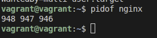

    беремо один і ідем досліджувати
    
    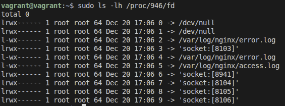

    дискриптори це числа від 0 - 9 що кожен з них означає
    0 - вхідний потік, оскільки nginx не чекає що ви будете щось писати йому в консоль, він заглушений
    1 - вихідний потік, nginx не виводить звичайний текст на екран тому цей канал теж заглужений.
    2 - помилоки системи, сюди записуються критичні збої самого процесу які виникають ще до того як nginx прочитав свій конфіг
    3 - це вухо яким nginx слухає порт 80
    4 - помилки додатка, цей дискриптор nginx відкрив сам щоб записувати туди помилки обробки запитів
    5 - сюди nginx записує вдалий або не вдалий вхід користувача на сайт, короче все
    6 - сокет для зєднання master process та worker process для того щоб вони могли спілкуватися між собою
    7 - теж слухав як і дискриптор 3 але 3 слухач IPv4 а цей IPv6
    8 - використовується для керування спільним сегментом пам'яті або передачі сигналів керування
    9 - ще один сокет для координація роботи кількох процесів робітників

3. Як читати логи сервера
    в нас є два головні фали для читання логів 
        access.log - тут фіксується кожен клік користувача
        error.log - сюди потрапляють повідомлення про помилки обробки запитів

    дивимося логи в реальному часі
    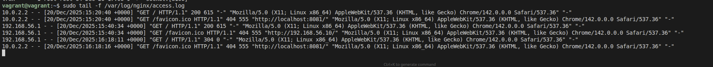

    перегляд всіх логів
    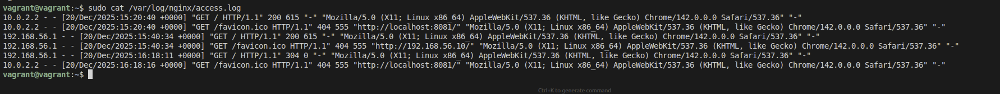

    перегляд всіх логів гортаючи їх вихід (Q)
    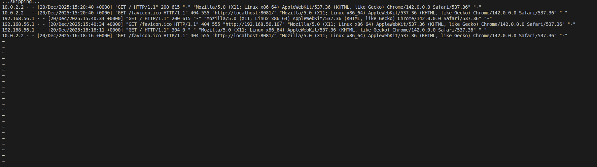

    пошук логів на помилкою
    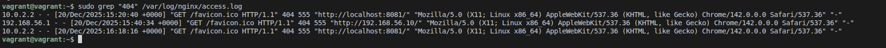

4. Чи можемо ми змінити конфігурацію веб-сервера, не перезавантажуючи його
    Це одна з ключових переваг Nginx, яка дозволяє змінювати налаштування сайту(додавати нові папки або змінювати порти) без жодної секунди простою
    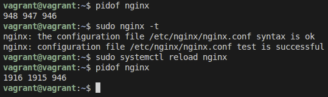

    Master PID (946) — залишився незмінним, це означає що деректор залишився
    Worker PID (947, 948) — змінилися на нові числа, це означає що старі робітники звільнилися, найнялися нові та стали працювати

PPA-репозиторій для Nginx

ppa не має
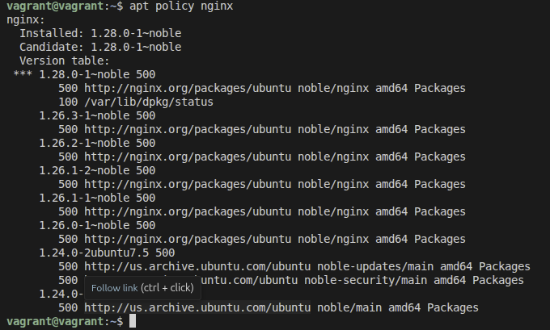

встановлюємо ppa
sudo add-apt-repository ppa:ondrej/nginx -y
sudo apt update

ppa зявилося
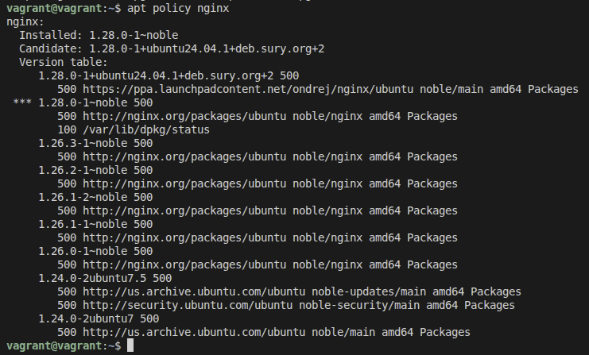

встановлюємо версію ppa
sudo apt install nginx -y
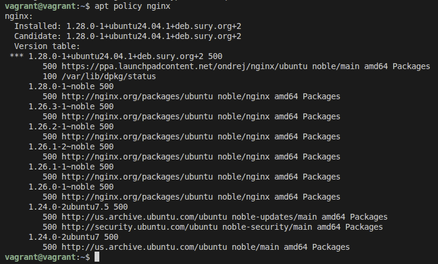

Видалення PPA через ppa-purge
встановлення ppa-purge
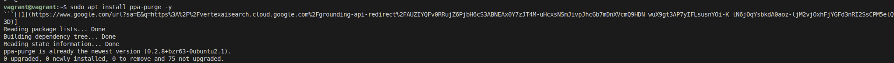

виконуємо команду для очищення
sudo ppa-purge ppa:ondrej/nginx

перевіряємо
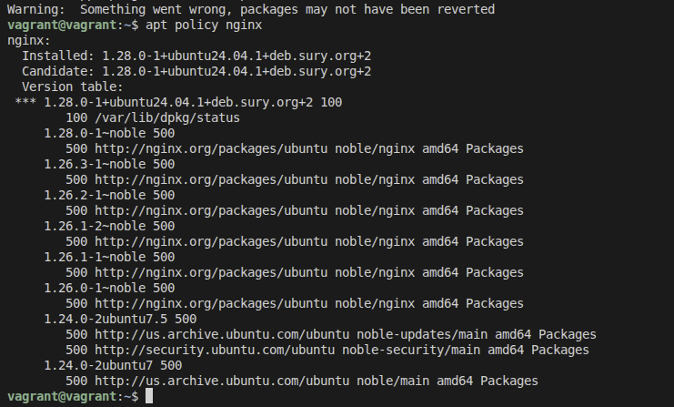
