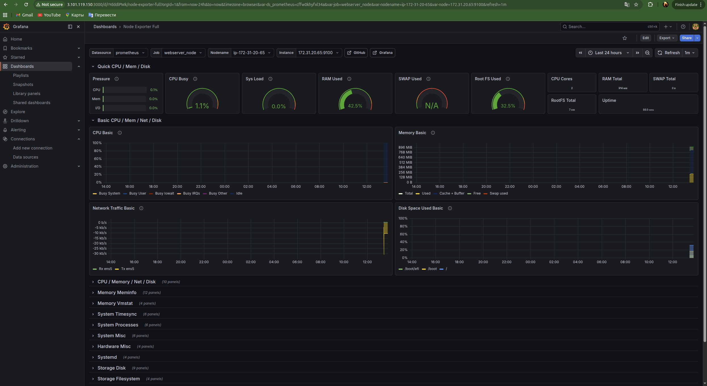
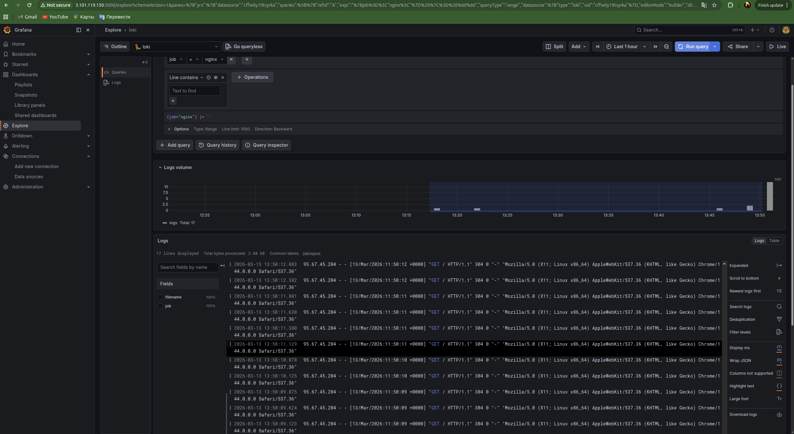
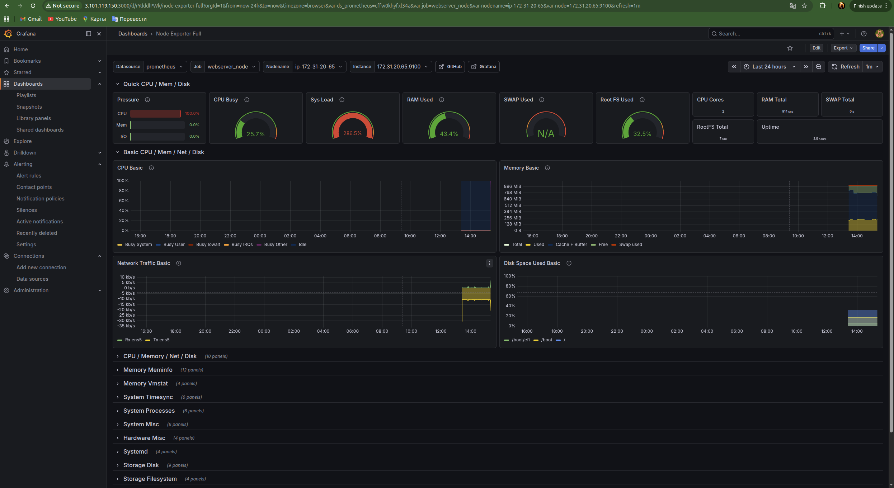
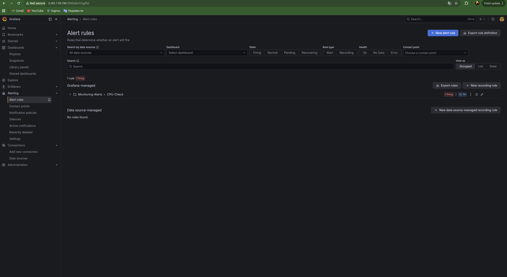
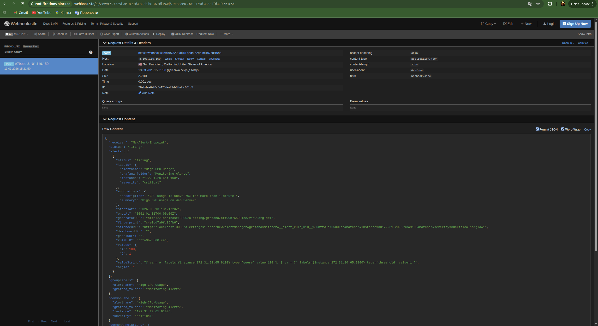

#Monitoring

##Інфраструктура:

Вся інфраструктура буде розгорнута на us-west-1

###
Monitoring-Serve = i-0c533fb9fa29b067f
puplic ip = 3.101.119.150
private ip = 172.31.20.201

Web-Server = i-0a5625072ad014a96
puplic ip = 54.176.250.151
private ip = 172.31.20.65

## Налаштування Web-Server

Підключаємося до web-server

```bash
ssh -i us-west-key.pem ubuntu@54.176.250.151
```

Встановлюємо Nginx, Node Exporter та Unzip
```bash
sudo apt update
sudo apt install -y nginx prometheus-node-exporter unzip
sudo systemctl enable --now nginx
sudo systemctl enable --now prometheus-node-exporter
```

Завантажуємо Promtail
```bash
curl -O -L "https://github.com/grafana/loki/releases/download/v2.9.3/promtail-linux-amd64.zip"
unzip promtail-linux-amd64.zip
sudo mv promtail-linux-amd64 /usr/local/bin/promtail
sudo chmod +x /usr/local/bin/promtail
```

Створюємо конфіг Promtail
```bash
sudo mkdir -p /etc/promtail

sudo cat << 'EOF' > /etc/promtail/promtail-config.yaml
server:
  http_listen_port: 9080
  grpc_listen_port: 0

positions:
  filename: /tmp/positions.yaml

clients:
  - url: http://172.31.20.201:3100/loki/api/v1/push

scrape_configs:
  - job_name: system
    static_configs:
    - targets:
        - localhost
      labels:
        job: varlogs
        __path__: /var/log/*log
  - job_name: nginx
    static_configs:
    - targets:
        - localhost
      labels:
        job: nginx
        __path__: /var/log/nginx/*log
EOF
```

Запускаємо Promtail як системний сервіс
```bash
sudo cat << 'EOF' > /etc/systemd/system/promtail.service
[Unit]
Description=Promtail client for Loki
After=network.target

[Service]
ExecStart=/usr/local/bin/promtail -config.file=/etc/promtail/promtail-config.yaml
Restart=always
User=root

[Install]
WantedBy=multi-user.target
EOF

sudo systemctl daemon-reload
sudo systemctl enable --now promtail.service
```

## Налаштування Monitoring-Serve

Підключаємось до Monitoring-Server
```bash
ssh -i us-west-key.pem ubuntu@3.101.119.150
```

Встановлюємо Docker і Docker Compose
```bash
sudo apt update
sudo apt install -y docker.io docker-compose
sudo systemctl enable --now docker
sudo usermod -aG docker ubuntu
```

Створюємо робочу папку для нашого проєкту
```bash
mkdir -p ~/monitoring/config
cd ~/monitoring
```

Створюємо конфіг для Prometheus
```bash
cat << 'EOF' > config/prometheus.yml
global:
  scrape_interval: 15s

scrape_configs:
  - job_name: 'prometheus'
    static_configs:
      - targets: ['localhost:9090']

  - job_name: 'webserver_node'
    static_configs:
      - targets: ['172.31.20.65:9100']
EOF
```

Створюємо Docker Compose файл
```bash
cat << 'EOF' > docker-compose.yml
version: '3.8'

services:
  prometheus:
    image: prom/prometheus:latest
    container_name: prometheus
    volumes:
      - ./config/prometheus.yml:/etc/prometheus/prometheus.yml
    ports:
      - "9090:9090"
    restart: unless-stopped

  loki:
    image: grafana/loki:2.9.3
    container_name: loki
    ports:
      - "3100:3100"
    command: -config.file=/etc/loki/local-config.yaml
    restart: unless-stopped

  grafana:
    image: grafana/grafana:latest
    container_name: grafana
    ports:
      - "3000:3000"
    environment:
      - GF_SECURITY_ADMIN_USER=admin
      - GF_SECURITY_ADMIN_PASSWORD=admin
    depends_on:
      - prometheus
      - loki
    restart: unless-stopped
EOF
```

Запускаємо
```bash
sudo docker-compose up -d
```

## Налаштування Grafana

Вхід у систему - http://3.101.119.150:3000 (Логін: admin, Пароль: admin)(Пароль не змінював)

### Підключення баз даних
```text
1.У лівому боковому меню Connections треба натиснути Data sources.

2.Add data source.

3.Підключаємо метрики:

    Треба клікнути на блок Prometheus.

    У полі Prometheus server URL вписати:
        http://prometheus:9090

    В самому низу Save & test.

4.Підключаємо логи:

    Знову переходимо в Data sources.

    Add data source -> Вибираємо Loki.

    У полі URL вписуємо:
        http://loki:3100

     В самому низу Save & test.
```

### Створення дашборду
```text
1. У лівому меню відкриваємо Dashboards.

2. Треба натиснути New і в меню що випаде вибрати Import.

3. У полі треба ввести цифри 1860 і натисни кнопку Load.

4. Далі натиснути Import.
```



### Перегляд логів Nginx
```text
1. Відкрий нову вкладку в браузера та переходимо за адресою Web-сервера(http://54.176.250.151) зявиться стандартна сторінка Welcome to nginx!. Пару раз оновимо її

2. Повернися в Grafana. У лівому меню заходимо в Explore.

3. Зліва зверху (де написано Prometheus) розкрий список і змінюємо його на Loki.

4. В полі Select label вибираємо job. У сусідньому полі вибираємо nginx.

5. Натискаємо кнопку Run query.
```



## Налаштування алертів у Grafana

### Створення Contact Point
```test
1.Перейди на сайт https://www.google.com.

2. Скопіюй унікальну URL-адресу(https://webhook.site/c597329f-ae18-4cda-b2db-bc107cdf19ad).

3. У Grafana перейди: Alerting -> Contact points.

4. Натисни New contact point.

5. Назви його My-Alert-Endpoint.

6. У списку Integration вибери Webhook.

7. У поле Url встав свою адресу з webhook.site.

8. Натисни Save contact point.
```

### Створення Alert Rule
```text
1. Define query and alert condition
    Натиснуто кнопку Code.

    Встав цей код:
        100 - (avg by(instance) (irate(node_cpu_seconds_total{job="webserver_node", mode="idle"}[1m])) * 100)

    Alert condition: 70

2. Add folder and labels (Блок 3)
    Folder: Натискаємо New folder, назвиваємо її Monitoring-Alerts і натискаємо Create.
    Labels: Натискаємо Add labels:
        Key: severity
        Value: critical
        Натисни Add label.

3. Set evaluation behavior (Блок 4)
    Evaluation group: Натискаємо New evaluation group. назвиваємо її CPU-Check. Evaluation interval ставимо 1m. Натискаємо Create.

4. Configure notifications (Блок 5)
    Contact point: Обираємо My-Alert-Endpoint.
```

### Перевірка

Підключись до Web-Server:
```bash
ssh -i us-west-key.pem ubuntu@54.176.250.151
```

Встанови утиліту для навантаження
```bash
sudo apt install -y stress
```

Запусти навантаження
```bash
stress --cpu 8
```

### Результат





