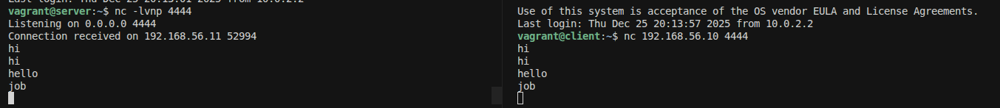
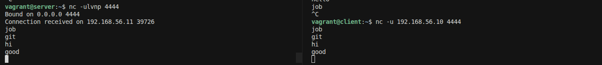
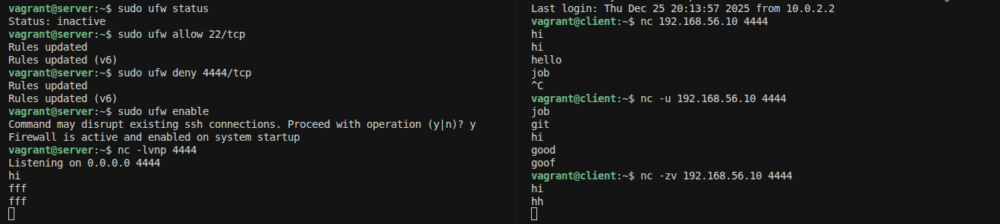
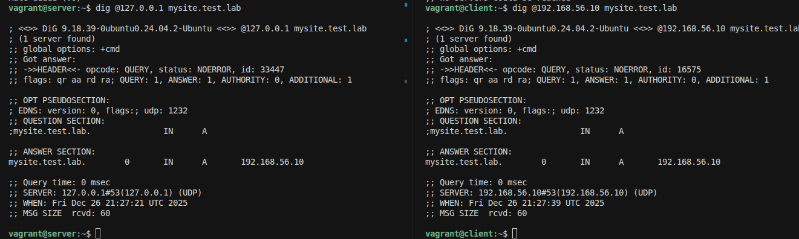

# Віртуальна машина

я розгорнув 2 приватні віртуальні машини на яких буде виконуватися лабараторна

    Vagrant.configure("2") do |config|
        config.vm.box = "bento/ubuntu-24.04"
    
        config.vm.define "server" do |server|
        server.vm.hostname = "server"
        
        server.vm.network "private_network", ip: "192.168.56.10"
        end
    
        config.vm.define "client" do |client|
        client.vm.hostname = "client"
        client.vm.network "private_network", ip: "192.168.56.11"
        end
    end

# Завдання 1: Створення мережевих з’єднань за допомогою netcat

Підєднання через TCP

вводимо команду хто саме буде слухати(server)

    nc -lvnp 4444

    nc: виклик самої утиліти netcat
    -l (listen): переводить netcat у режим слухача, машина стає сервером і чекає поки хтось до неї підєднається
    -n (numeric): каже програмі не витрачати час на запити до DNS для визначення імен хостів, тільки IP-адреси
    -v (verbose): виводить інформацію про те що хтось підключився або стався розрив
    -p 4444 (port): вказує конкретний номер порту (4444) який ми відкриваємо для вхідних даних

далі підєднуємося до слухача(client)

    nc 192.168.56.10 4444

резустат TCP

Підєднання через UDP

вводимо команду хто саме буде слухати(server)

    nc -ulvnp 4444

    -u : вказуємо що підєднуємося по UDP

далі підєднуємося до слухача(client)

    nc -u 192.168.56.10 4444

резустат UDP

Різниця між TCP та UDP

TCP - це як дзвінок по телефону поки на іншій стороні не вільмуть трубу нічого не відбудеться

UDP - це як відправка звичайного листа пошто він відправлний але фак фак що його побачили та переглянули

Блокування брандмауером

Дозволяємо зєднання по ssh

    sudo ufw allow 22/tcp

створюємо правило блокування для порту 4444(TCP)

    sudo ufw deny 4444/tcp

активуємо брандмауер

    sudo ufw enable

роимо зєднання та перевіряємо 

-z : прапорець для сканування, програма просто перевіряє чи відкритий порт не очікуючи на ввід тексту
-v : виведе детальний результат

# Завдання 2: Конфігурація DNS

скачуємо dnsmasq

    sudo apt update
    sudo apt install dnsmasq -y

перевіряємо статус 

    sudo systemctl status dnsmasq

налаштування dnsmasq

нам потрібно сказати dnsmasq слухати запити саме на вашій приватній IP-адресі 192.168.56.10

відкрийте конфігураційний файл

    sudo nano /etc/dnsmasq.conf

добавляємо

    #Слухати на конкретній IP-адресі приватної мережі
    listen-address=127.0.0.1, 192.168.56.10
    #Не використовувати імена з зовнішніх DNS, якщо вони не повні
    domain-needed
    bogus-priv
    #Власний домен для локальної мережі
    domain=test.lab

створення DNS-записів

    sudo nano /etc/hosts

добавляємо

    192.168.56.10 mysite.test.lab
    192.168.56.11 client.test.lab

перезапускаємо dnsmasq

    sudo systemctl restart dnsmasq

в client встановлюємо удиліту для перевірки

    sudo apt update && sudo apt install dnsutils -y

перевіряємо зєднання

    ig @192.168.56.10 mysite.test.lab

# Завдання 3: Розбивання на підмережі
