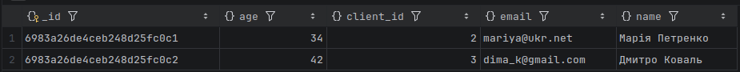
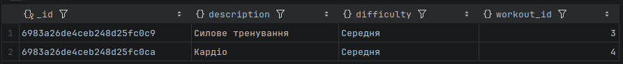
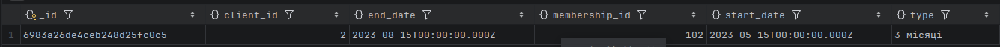

#NoSQL

## Дане завдання було виконано з рорзгортанням контейнера docker з базою, виконання відбувалося в IDE DataGrip

## робота з MongoDB на тему спортзалу

### 1. Створення бази даних та колекцій:

```bash
use registry;

db.createCollection("clients");
db.createCollection("memberships");
db.createCollection("workouts");
db.createCollection("trainers");
```

### 2. Визначення схеми документів та 3. Заповнення колекцій даними:

Клієнти

```bash
db.clients.insertMany([
  { client_id: 1, name: "Олександр Іванов", age: 25, email: "olex@gmail.com" },
  { client_id: 2, name: "Марія Петренко", age: 34, email: "mariya@ukr.net" },
  { client_id: 3, name: "Дмитро Коваль", age: 42, email: "dima_k@gmail.com" },
  { client_id: 4, name: "Анна Сидоренко", age: 29, email: "anna.s@gmail.com" }
]);
```

абонемент

```bash
db.memberships.insertMany([
  { membership_id: 101, client_id: 1, start_date: ISODate("2024-01-01"), end_date: ISODate("2025-01-01"), type: "Річний" },
  { membership_id: 102, client_id: 2, start_date: ISODate("2024-02-15"), end_date: ISODate("2024-05-15"), type: "3 місяці" },
  { membership_id: 103, client_id: 3, start_date: ISODate("2024-03-01"), end_date: ISODate("2024-04-01"), type: "Місячний" }
]);
```

тип тренування

```bash
db.workouts.insertMany([
  { workout_id: 1, description: "Йога для спини", difficulty: "Легка" },
  { workout_id: 2, description: "Кросфіт", difficulty: "Висока" },
  { workout_id: 3, description: "Силовий тренінг", difficulty: "Середня" },
  { workout_id: 4, description: "Кардіо інтенсив", difficulty: "Середня" }
]);
```

тренери

```bash
db.trainers.insertMany([
  { trainer_id: 1, name: "Віталій Кличко", specialization: "Бокс" },
  { trainer_id: 2, name: "Оксана Фіт", specialization: "Пілатес" }
]);
```

### 4. Запити 

Знайдіть всіх клієнтів віком понад 30 років

```bash
db.clients.find({ age: { $gt: 30 } });
```

вивід



Перелічіть тренування із середньою складністю

```bash
db.workouts.find({ difficulty: "Середня" });
```

вивід



Покажіть інформацію про членство клієнта з певним client_id

```bash
db.memberships.find({ client_id: 2 });
```

вивід




