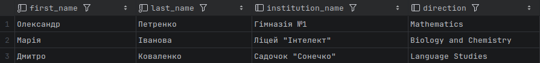
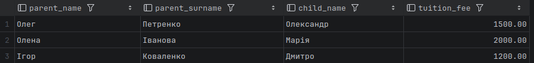
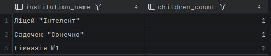
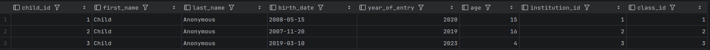
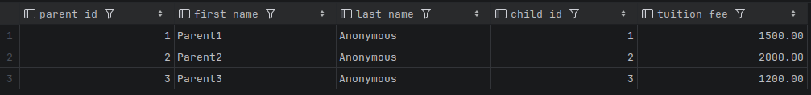
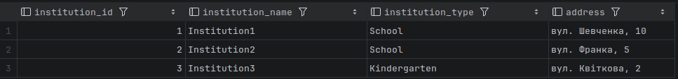
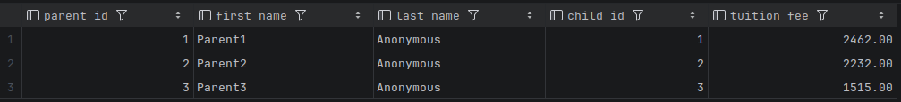

# Дане завдання було виконано не на MySQL а на postgresql якщо це не є проблемою, також був розгорнутий контейнер docker з самою базою, виконання відбувалося в IDE DataGrip

## Завдання 1: Створення бази даних для шкіл та дитячих садочків

створення схеми в базі 

    CREATE SCHEMA puplic;

створення всіх табличок які описані в завданні

```bash
SET search_path TO public;

-- 1. Створення переліків Enums
CREATE TYPE public.institution_enum AS ENUM ('School', 'Kindergarten');
CREATE TYPE public.direction_enum AS ENUM ('Mathematics', 'Biology and Chemistry', 'Language Studies');

-- 2. Таблиця закладів
CREATE TABLE public.Institutions (
    institution_id SERIAL PRIMARY KEY,
    institution_name VARCHAR(255) NOT NULL,
    institution_type public.institution_enum NOT NULL,
    address VARCHAR(255) NOT NULL
);

-- 3. Таблиця класів
CREATE TABLE public.Classes (
    class_id SERIAL PRIMARY KEY,
    class_name VARCHAR(50) NOT NULL,
    institution_id INT REFERENCES public.Institutions(institution_id) ON DELETE CASCADE,
    direction public.direction_enum NOT NULL
);

-- 4. Таблиця дітей
CREATE TABLE public.Children (
    child_id SERIAL PRIMARY KEY,
    first_name VARCHAR(100) NOT NULL,
    last_name VARCHAR(100) NOT NULL,
    birth_date DATE NOT NULL,
    year_of_entry INT NOT NULL,
    age INT,
    institution_id INT REFERENCES public.Institutions(institution_id) ON DELETE SET NULL,
    class_id INT REFERENCES public.Classes(class_id) ON DELETE SET NULL
);

-- 5. Таблиця батьків
CREATE TABLE public.Parents (
    parent_id SERIAL PRIMARY KEY,
    first_name VARCHAR(100) NOT NULL,
    last_name VARCHAR(100) NOT NULL,
    child_id INT REFERENCES public.Children(child_id) ON DELETE CASCADE,
    tuition_fee DECIMAL(10, 2)
);
```

заповнюємо данні

```bash
-- Заклади
INSERT INTO public.Institutions (institution_name, institution_type, address) VALUES
('Гімназія №1', 'School', 'вул. Шевченка, 10'),
('Ліцей "Інтелект"', 'School', 'вул. Франка, 5'),
('Садочок "Сонечко"', 'Kindergarten', 'вул. Квіткова, 2');

-- Класи
INSERT INTO public.Classes (class_name, institution_id, direction) VALUES
('10-A', 1, 'Mathematics'),
('11-B', 2, 'Biology and Chemistry'),
('Група Бджілки', 3, 'Language Studies');

-- Діти
INSERT INTO public.Children (first_name, last_name, birth_date, year_of_entry, age, institution_id, class_id) VALUES
('Олександр', 'Петренко', '2008-05-15', 2020, 15, 1, 1),
('Марія', 'Іванова', '2007-11-20', 2019, 16, 2, 2),
('Дмитро', 'Коваленко', '2019-03-10', 2023, 4, 3, 3);

-- Батьки
INSERT INTO public.Parents (first_name, last_name, child_id, tuition_fee) VALUES
('Олег', 'Петренко', 1, 1500.00),
('Олена', 'Іванова', 2, 2000.00),
('Ігор', 'Коваленко', 3, 1200.00);
```

Список дітей із закладом та напрямом

```bash
SELECT 
    c.first_name, 
    c.last_name, 
    i.institution_name, 
    cl.direction
FROM public.Children c
JOIN public.Institutions i ON c.institution_id = i.institution_id
JOIN public.Classes cl ON c.class_id = cl.class_id;
```

вивід



Батьки, діти та вартість

```bash
SELECT
    p.first_name AS parent_name,
    p.last_name AS parent_surname,
    c.first_name AS child_name,
    p.tuition_fee
FROM public.Parents p
JOIN public.Children c ON p.child_id = c.child_id;
```

вивід



Кількість дітей у кожному закладі
```bash
SELECT
    i.institution_name,
    COUNT(c.child_id) AS children_count
FROM public.Institutions i
LEFT JOIN public.Children c ON i.institution_id = c.institution_id
GROUP BY i.institution_id, i.institution_name;
```

вивід



## Додаткове завдання: анонімізація даних

Анонімізація імен дітей

```bash
UPDATE public.Children 
SET first_name = 'Child', 
    last_name = 'Anonymous'
RETURNING *;
```

вивід



Анонімізація батьків

```bash
UPDATE public.Parents
SET first_name = 'Parent' || parent_id,
    last_name = 'Anonymous'
RETURNING *;
```

вивід



Анонімізація назв закладів

```bash
UPDATE public.Institutions
SET institution_name = 'Institution' || institution_id
RETURNING *;
```

вивід



Зміна вартості навчання на випадкову

```bash
UPDATE public.Parents
SET tuition_fee = floor(1000 + (random() * 2000))
RETURNING *;
```

вивід

