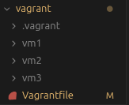
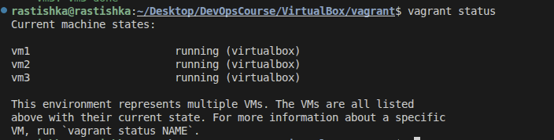

Virtualization/VBox
1. Встановлення VirtualBox:

2. Створення нової віртуальної машини:
3. Налаштування VM:
заповнюємо назву віртуальної машини та операційну систему яку будемо ставити

ставимо розмір диска, оперативки та процесора + також ставимо галочку на EFI

створюємо vm 

налаштовуємо підключення до інтернету яке йде від твоєї власної операційної на віртуальну машшину

4. Інсталяція операційної системи:
потрібно завантажити iso файл на свій диск та завантажити його

стартуємо

5. Збереження та відновлення стану VM:

зробили папку для тесту

створили снепшот

створлиит папку для тесту щоб подитися чи спрацює снепшот

застосовуємо снапшот

після застосування все вертається в точку з якою бов зроблений снепшот

видаляємо снепшот 

6. Зміна параметрів віртуальної машини через графічний інтерфейс:

змінюємо в налаштуваннях ram та cpu

оскільки я не знайшов як змінити память через веб мору я застосував скрипт для зміни

ми память збільшили але вона не застосована до диска тому нам потрібно йоо застосувати ми запускаємо віртуально машину та знаходимо дискову утіліту та добавляємо память

7. Вимкнення та видалення VM:
ми не закриваємо вікно а вимикаємо його звичайним способ через Power off...

далі коли його видаляємо обовязково ставимо галочку щоб видалити сам файл з віртуальною машиною

Додаткове завдання (за бажанням):
Створити Vagrantfile, який запускає кілька віртуальних машин.

створюємо папку в якій в нас будуть лежати Vagrantfile та три папки для наших віртуалок(скільки віртуалок стільки і папок) навіть якщо в них нічого не буде лежати потрібно щоб вони були так як без них не створиться віртуалка також все що буде створене в віртуальці буде відображатися в папці цієї віртуалки

#грубо кажучи наприклад в нас є сайт користувач буде стукатися по посиланню на сайт, він першим ділом перейде на vm3 так як це публічний сервер потім vm3 відасть на загально доступний север де в нас код який обробить сторінку або застосує якийсь алгорит і щось нам видасть
#але в нас є приватний сервер тут мають лежати бази даних в яких зберігається інформація, тобто vm3 звертається до vm1 забирає потрібні данні з vm2 та виводить сторінку користувачу

###   ПРОХАННЯ ПОВІДОМИТИ ЯКЩО ЩОСЬ НЕ ВІРНО СКАЗАВ АБО СДОПОВНИТИ. ВЕЛЕЧЕЗНЕ ДЯКУЮ

Vagrant.configure("2") do |config| #Шапка створення 
    config.vm.box = "bento/ubuntu-24.04" #В усіх нижце віртуальних машин буде операційка яка прописана тут
  
    # =================================================================
    # 1. VM1: Загальнодоступний вебсервер (DHCP) 
    # =================================================================
    config.vm.define "vm1" do |subconfig| #Шапка віртуальної машини та її назва
      # Тут ведеться опиш віртуалки
      subconfig.vm.hostname = "webserver-vm1" #назва віртуалки яку ви будемо бачити кли в неї зайдемо
  
      subconfig.vm.network "public_network" #для зєднання з vm3

      subconfig.vm.network "private_network", ip: "192.168.56.10" #для зєднання з vm2
  
      subconfig.vm.synced_folder "./vm1", "/home/vagrant/test_vm1" # все лежить в папці яка прописана перша має зявитися те що прописано в другому
  
      subconfig.vm.provision "shell", inline: "echo 'vm1 done'" # виконується команда коли запустилася віртуалка
    end
  
    # =================================================================
    # 2. VM2: Приватний сервер (Static IP)
    # =================================================================
    config.vm.define "vm2" do |subconfig|
      subconfig.vm.hostname = "private-vm2"
  
      subconfig.vm.network "private_network", ip: "192.168.56.20" # приватний ip
  
      subconfig.vm.synced_folder "./vm2", "/home/vagrant/test_vm2"
  
      subconfig.vm.provision "shell", path: "vm2/script.sh" # виконується команда коли запустилася віртуалка
    end
  
    # =================================================================
    # 3. VM3: Публічний сервер (Static IP + Bridge) 
    # =================================================================
    config.vm.define "vm3" do |subconfig|
      subconfig.vm.hostname = "static-vm3"
  
      subconfig.vm.network "public_network", ip: "192.168.1.222", bridge: "wlp3s0" # прописуємо публічний ip та прописуєм мережеву карту(прописаний роутер)
  
      subconfig.vm.synced_folder "./vm3", "/home/vagrant/test_vm3"
  
      subconfig.vm.provision "shell", inline: "echo 'vm3 done'" # виконується команда коли запустилася віртуалка
    end
  
    config.vm.provider "virtualbox" do |vb|
      vb.memory = "1024" # ram
      vb.cpus = 1 # cpu
    end
  end

запускаємо vagrant up потім потрібно буде вибрати тип карти який в нас стоїть дивимися чи все запустилося

