Virtualization/VBox
1. Встановлення VirtualBox:
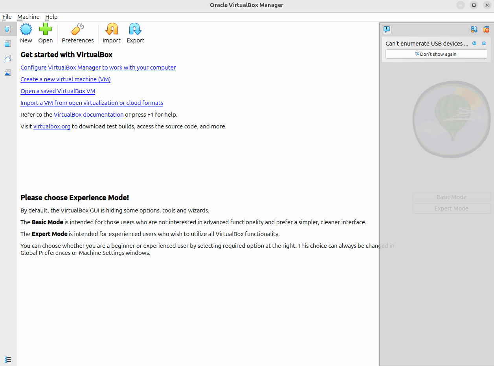

2. Створення нової віртуальної машини:
3. Налаштування VM:
заповнюємо назву віртуальної машини та операційну систему яку будемо ставити
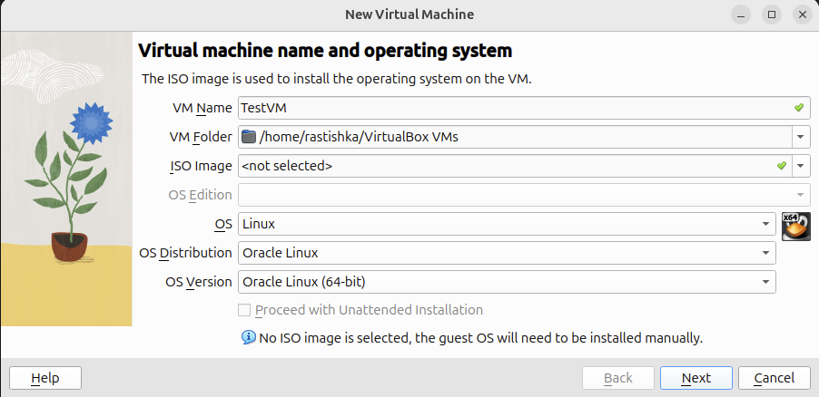

ставимо розмір диска, оперативки та процесора + також ставимо галочку на EFI

створюємо vm 
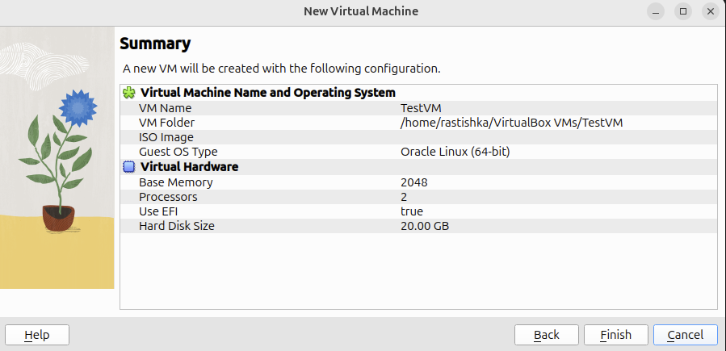

налаштовуємо підключення до інтернету яке йде від твоєї власної операційної на віртуальну машшину
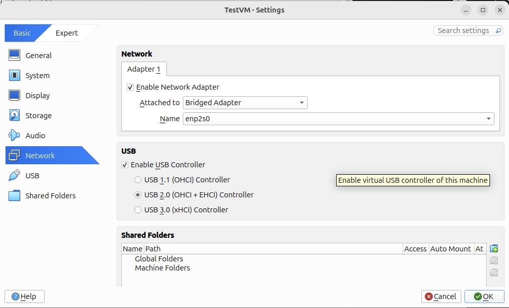

4. Інсталяція операційної системи:
потрібно завантажити iso файл на свій диск та завантажити його
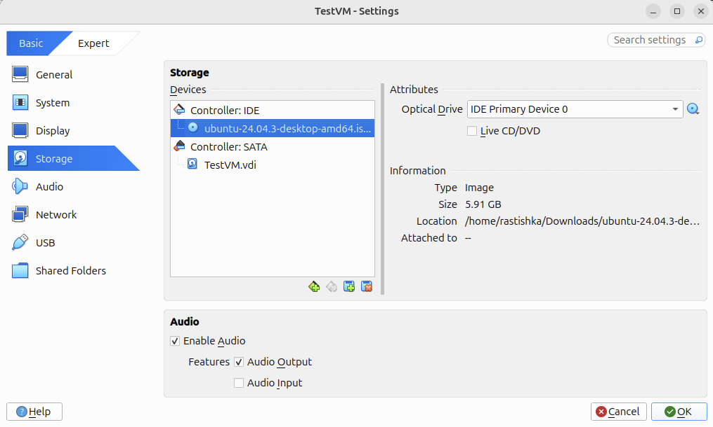

стартуємо
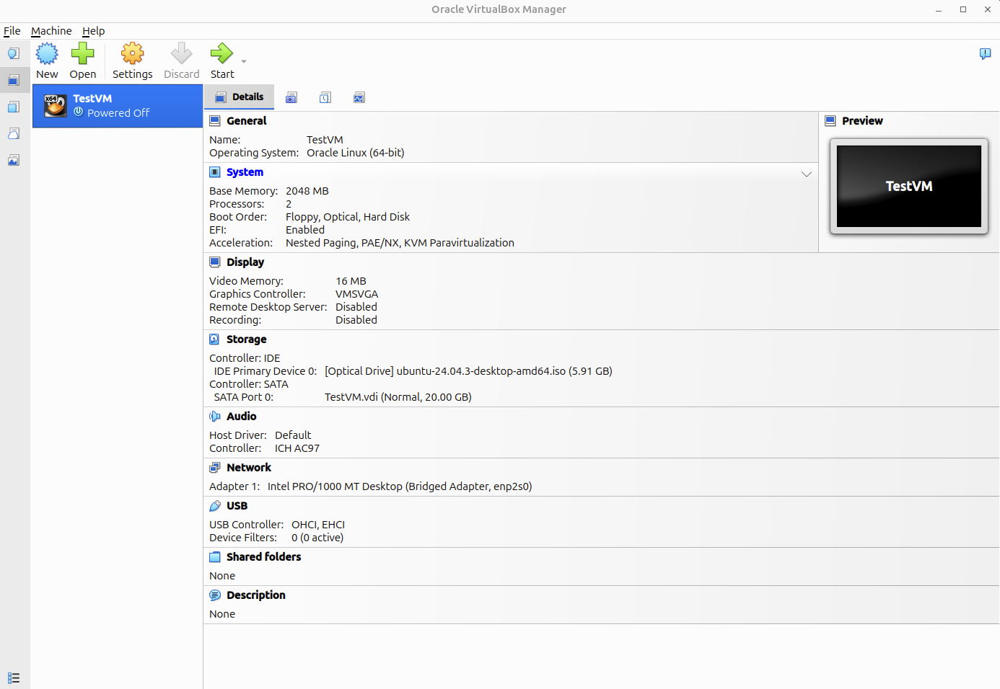

5. Збереження та відновлення стану VM:

зробили папку для тесту

створили снепшот
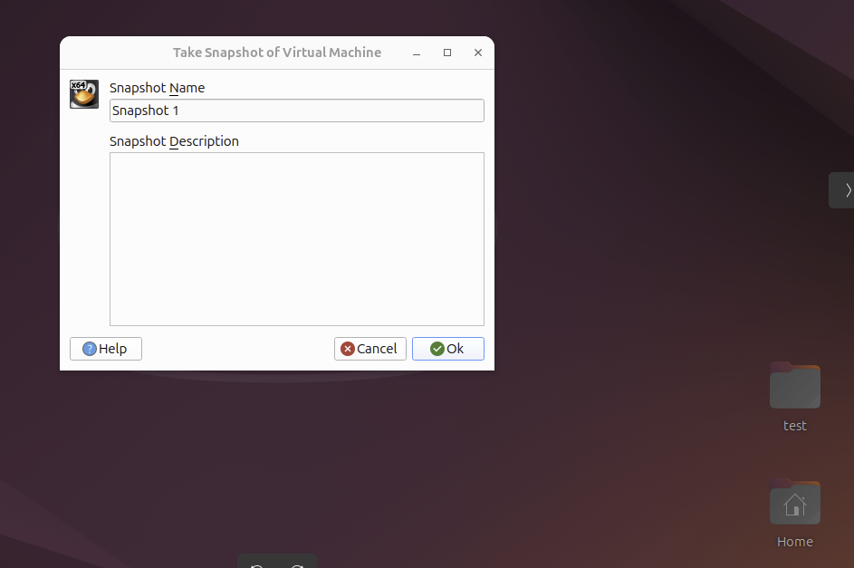

створлиит папку для тесту щоб подитися чи спрацює снепшот
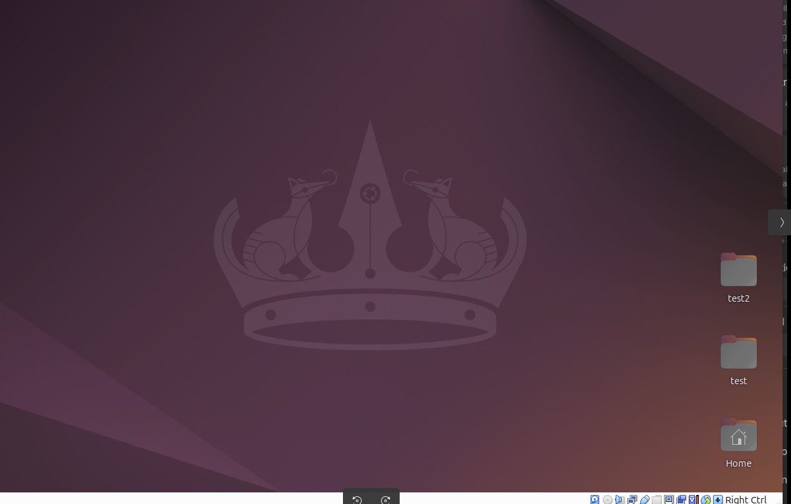

застосовуємо снапшот
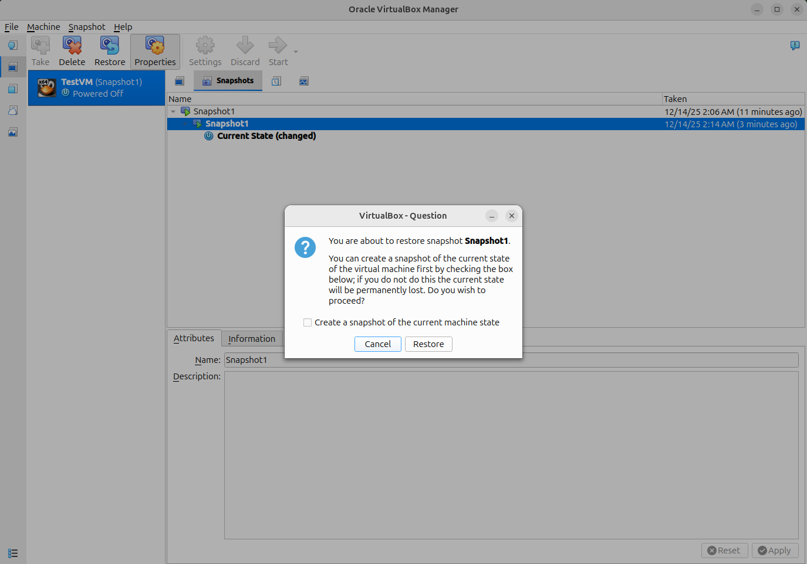

після застосування все вертається в точку з якою бов зроблений снепшот

видаляємо снепшот 
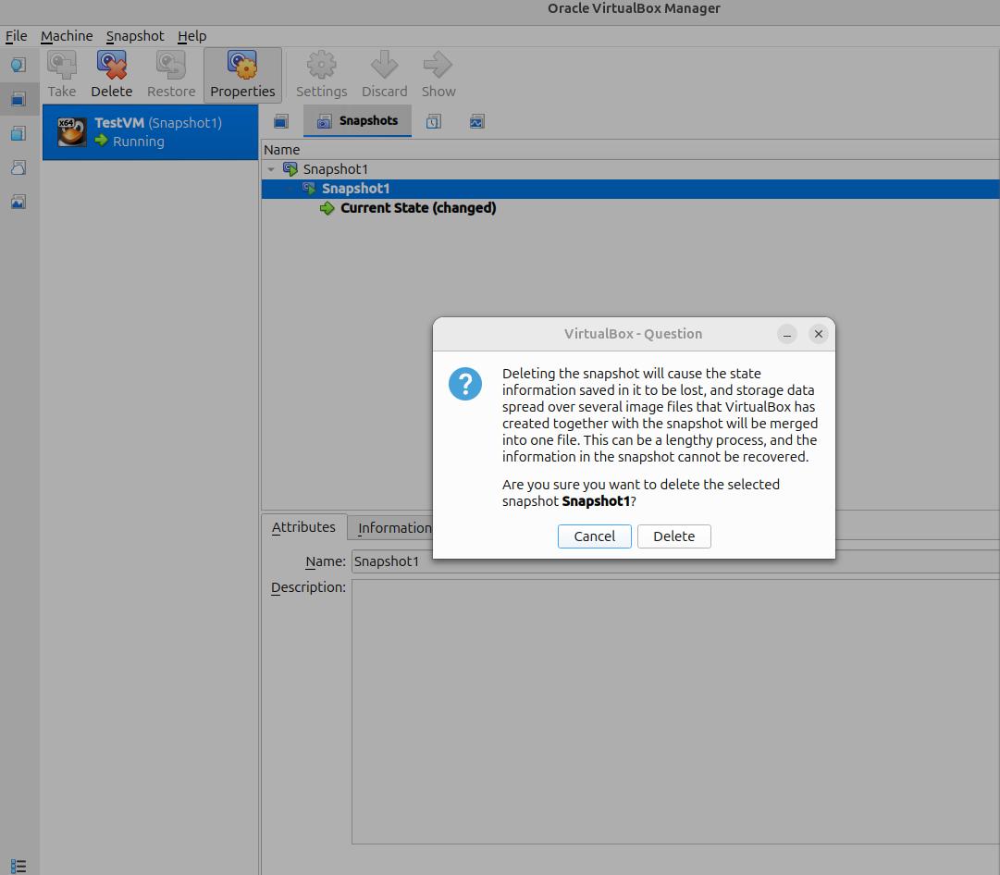

6. Зміна параметрів віртуальної машини через графічний інтерфейс:

змінюємо в налаштуваннях ram та cpu
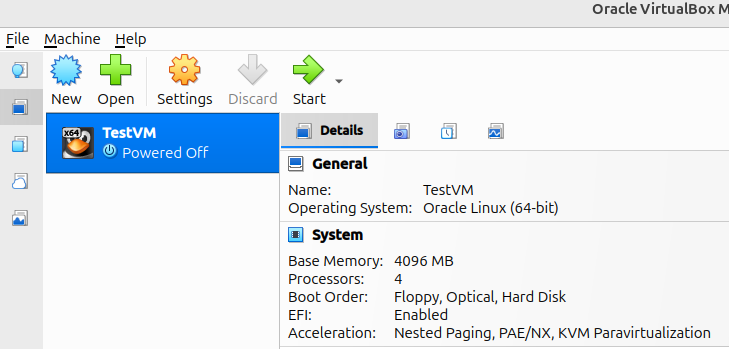

оскільки я не знайшов як змінити память через веб мору я застосував скрипт для зміни
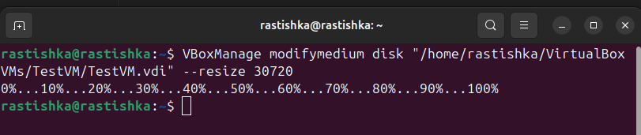
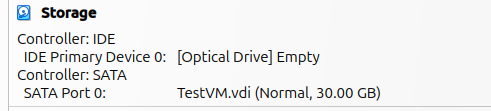

ми память збільшили але вона не застосована до диска тому нам потрібно йоо застосувати ми запускаємо віртуально машину та знаходимо дискову утіліту та добавляємо память
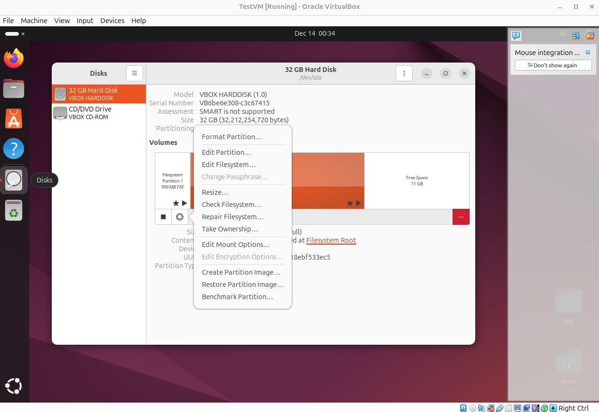
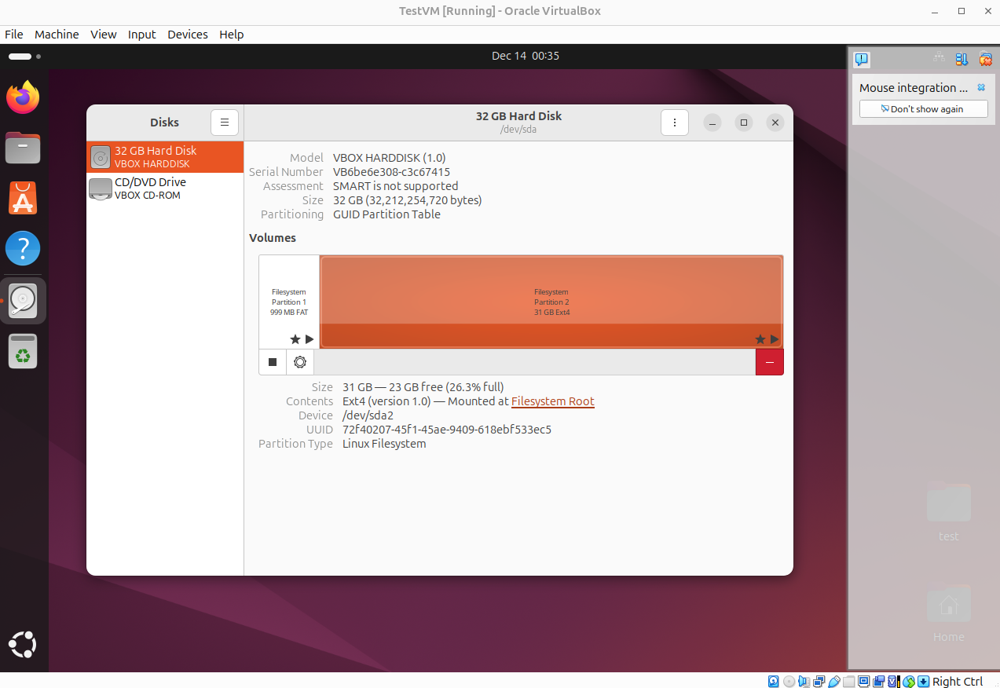

7. Вимкнення та видалення VM:
ми не закриваємо вікно а вимикаємо його звичайним способ через Power off...

далі коли його видаляємо обовязково ставимо галочку щоб видалити сам файл з віртуальною машиною
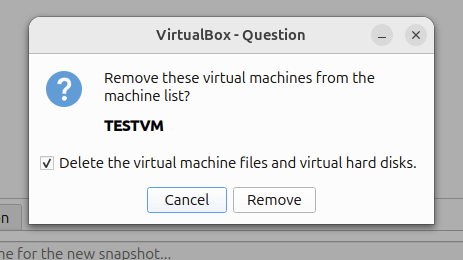

Додаткове завдання (за бажанням):
Створити Vagrantfile, який запускає кілька віртуальних машин.

Владиславе якщо ти дійшов дійов до цього пункту то я його зробив протсо ще не сформував звіт так як задовбую іі щоб зрозуміти як це працює,він буде думаю завтра післязавтра
  
